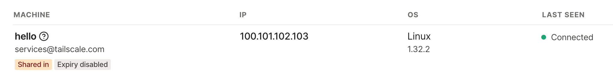

# Tailscale with Gitpod

[Tailscale](https://tailscale.com/) allows [Gitpod](https://www.gitpod.io/) CDE workspaces to access private private resources such as databases, S3 buckets, local services, etc.

## Demo

### Tailscale setup: 

* Signup for a new A [Tailscale account](https://login.tailscale.com/login)
* Navigate to your [Tailscale Machines tab](https://login.tailscale.com/admin/machines) and copy the IP address of the example `hello` application



* Verify that reaching the example Tailscale `hello` application via `ping` fails.

### Gitpod workspace

* Click the button below to start a new development environment:

[](https://gitpod.io/#https://github.com/gitpod-io/demo-tailscale-with-gitpod)

* Login to your Tailscale account when prompted from the Gitpod workspace terminal:
```
To authenticate, visit:
        https://login.tailscale.com/a/XXXXXXXXXXXX
```
* Verify that reaching the example Tailscale `hello` application via `ping` succeeds.